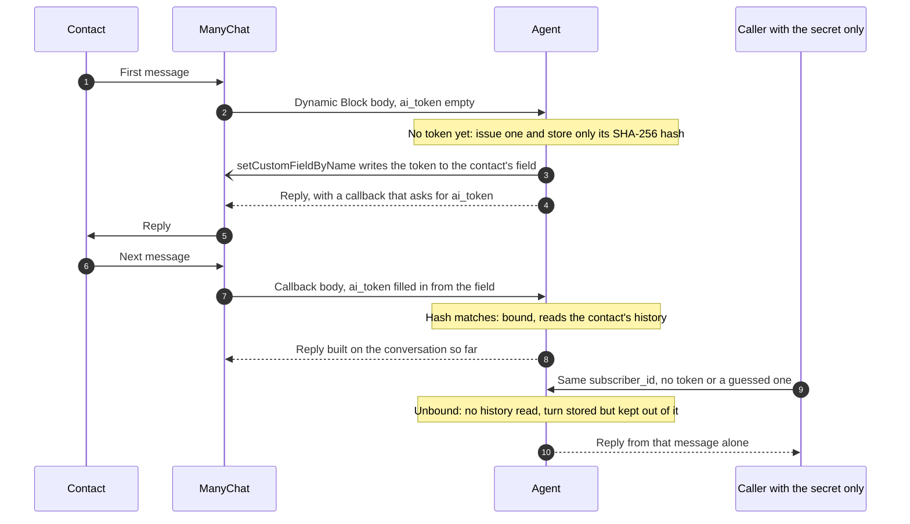
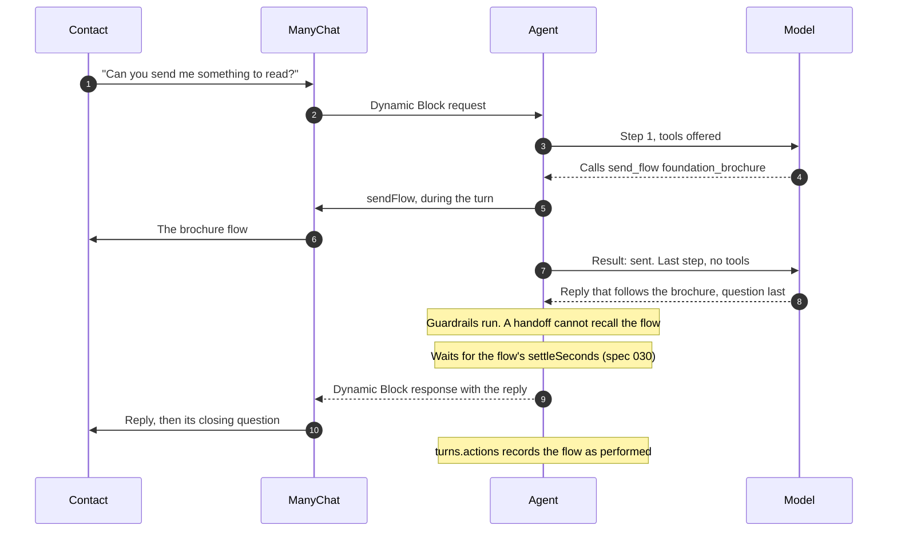
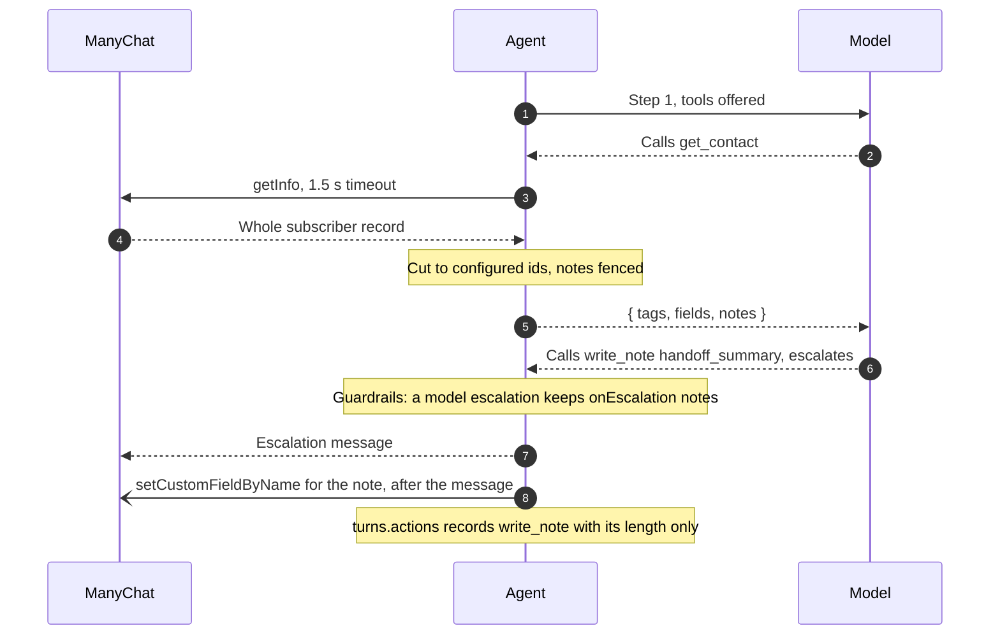
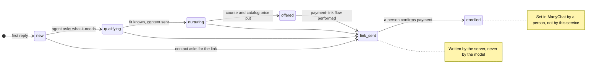

# ManyChat AI Agent

[](https://github.com/pedronastasi/manychat-ai-agent/actions/workflows/ci.yml)
[](https://pedronastasi.github.io/manychat-ai-agent/)
[](LICENSE)
[](https://github.com/pedronastasi/manychat-ai-agent/releases)
[](package.json)

A production-shaped, provider-agnostic AI agent that answers customer questions
on WhatsApp through [ManyChat](https://manychat.com), escalating to a human
rather than guessing.

Switching the model is one environment variable. Switching the chat platform is
one adapter.

It is for anyone putting an LLM behind a platform that enforces a hard webhook
timeout: ManyChat is the adapter that ships, and the race and the outbox below
are what carries over to any other.

```bash
git clone https://github.com/pedronastasi/manychat-ai-agent.git
cd manychat-ai-agent
pnpm install && pnpm bootstrap && pnpm dev
```

That runs with **no API key and no database to install** — an offline mock model
and an embedded [PGlite](https://pglite.dev/) Postgres. In another terminal,
`pnpm simulate` answers one question and hands one off:



---

## The problem this solves

ManyChat can call an external endpoint, but **it terminates the request after 10
seconds**. An LLM call plus database work sometimes fits in that budget and
sometimes does not, so the obvious synchronous design drops replies under exactly
the conditions where a customer is already waiting.

This project takes the position that neither "always answer inline" nor "always
queue" is right, and races them.

```
inbound message
     │
     ├─ guards: keywords, turn cap, rate limit, daily budget ── denied ──▶ escalate to human
     │                                                                     (model never runs)
     ▼
  Promise.race
     ├── model answered  (< 8s) ──▶ reply inline + re-register callback
     │
     └── deadline hit    (= 8s) ──▶ short ack
                                     │
                                     └─ model keeps running ──▶ outbox ──▶ worker ──▶ Send API
```

The losing model call is **not cancelled**. Those tokens are already paid for and
the answer is still wanted, so it completes into a Postgres outbox and a worker
delivers it seconds later. The reply is never dropped, only deferred.

The conversation loop lives in this service rather than in ManyChat's visual flow
builder, via Dynamic Block's `external_message_callback`. That is what keeps the
agent portable instead of welded to one vendor's UI.

## Design decisions

Every non-obvious choice is written down in [`docs/adr/`](docs/adr/):

| ADR                                                                       | Decision                                                                                                 |
| ------------------------------------------------------------------------- | -------------------------------------------------------------------------------------------------------- |
| [0001](docs/adr/0001-hybrid-race-reply-path.md)                           | Race the model against a deadline instead of choosing sync or async                                      |
| [0002](docs/adr/0002-provider-agnostic-model-layer.md)                    | One registry module may import providers; everything else uses a port (superseded)                       |
| [0003](docs/adr/0003-contract-first-with-zod.md)                          | Zod schemas generate both the types and the OpenAPI document (superseded)                                |
| [0004](docs/adr/0004-postgres-outbox-over-redis.md)                       | A Postgres outbox, not Redis — one datastore, transactional enqueue                                      |
| [0005](docs/adr/0005-channel-port-single-adapter.md)                      | Define the channel port, ship exactly one adapter                                                        |
| [0006](docs/adr/0006-manychat-auth-risk-accepted.md)                      | ManyChat does not sign webhooks; the compensating controls, written down (superseded)                    |
| [0007](docs/adr/0007-generateobject-not-toolloop.md)                      | `generateObject`, not a tool loop, while there are no tools (superseded)                                 |
| [0008](docs/adr/0008-classes-for-port-implementations.md)                 | Ports are implemented by classes; functions stay for pure transformation                                 |
| [0009](docs/adr/0009-no-single-letter-identifiers.md)                     | Identifiers are at least two characters, enforced by lint                                                |
| [0010](docs/adr/0010-bounded-tool-loop-with-staged-actions.md)            | A two-step tool loop whose tools stage actions; the server performs them after guardrails                |
| [0011](docs/adr/0011-model-graded-evals-behind-calibration.md)            | A judge model grades evals only in a run where it first agrees with hand-labelled calibration            |
| [0012](docs/adr/0012-contact-tokens-held-in-manychat.md)                  | Each contact has a token held by ManyChat; only a request carrying it reads that contact's history       |
| [0013](docs/adr/0013-history-spans-30-days-turn-cap-resets-daily.md)      | History reaches back 30 days; the turn cap resets after 24 hours of silence                              |
| [0014](docs/adr/0014-log-conversation-id-not-pseudonym.md)                | Logs identify a contact by the conversation's random ID, not a hash of the subscriber ID                 |
| [0015](docs/adr/0015-the-agent-closes-the-sale.md)                        | The agent takes a lead to the payment link itself; every C6 limit on what it may claim stays             |
| [0016](docs/adr/0016-reads-are-performed-inside-the-loop.md)              | Read tools are performed when called and the loop grows to four steps; writes are still staged           |
| [0017](docs/adr/0017-bounded-free-text-notes.md)                          | Free text only in declared note fields no flow renders, length-capped and stripped of identifiers        |
| [0018](docs/adr/0018-port-to-python-beside-typescript-on-one-database.md) | Port to Python on LangChain, LangGraph, FastAPI and Pydantic, cut over beside TypeScript on one database |
| [0019](docs/adr/0019-flows-are-sent-inside-the-loop.md)                   | On an inbound turn a flow is sent when the model calls it, so the reply follows it; other writes stage   |

Behavior is specified before it is implemented, in [`specs/`](specs/) —
a [constitution](specs/000-constitution.md) of non-negotiables, the
[agent's behavior](specs/001-agent-behavior.md), and the
[channel contract](specs/002-channel-contract.md). Tests cite the clause they
enforce.

## Model agnosticism

No module imports a provider package except
[`src/agent/registry.ts`](src/agent/registry.ts). The active model is a string:

```bash
AGENT_MODEL=anthropic:claude-haiku-4-5   # default
AGENT_MODEL=openai:gpt-5-mini            # same behavior, zero code changed
AGENT_MODEL=google:gemini-2.5-flash
AGENT_MODEL=ollama:llama3.1:8b           # local, free — see "Local model" below
AGENT_MODEL=mock:demo                    # offline, deterministic, free
```

Callers depend on an `AgentRunner` port, not on the AI SDK, so replacing even the
SDK is contained to one file.

## What makes it production-shaped

**Fails closed, toward a human.** Low model confidence, a schema violation, an
exhausted budget, a rate limit, or a provider outage all escalate. The agent
never invents a price — an unanswerable question is a handoff, by design.

**Untrusted input, treated as such.** Contact text is fenced and labelled as
data, with the fence markers stripped first so they cannot be forged. Model
output is validated before any of it reaches a customer, and replies that leak
the prompt are dropped. The golden set includes injection attempts.

**A contact's history is theirs, not whoever names them.** The shared secret
proves a request came from the flow, not which contact it speaks for. Each
contact has a random token kept in their own ManyChat custom field and stored
here only as a hash. A request without it is answered from its own message
alone, so a leaked secret does not expose anyone's conversation
([spec 019](specs/019-contact-tokens.md)).

**Spend is bounded.** Every turn records tokens, cache hits, and estimated cost.
Daily token and dollar caps degrade to escalation rather than to an error — a
bill cap that fails into a human is the correct failure mode for a business.

**Channel constraints are data, not memory.** Quick replies silently do nothing
on WhatsApp; ManyChat accepts them and the contact never sees them. That lives in
a `ChannelCapabilities` value with a test, not in a comment someone forgets.

**No PII in logs.** Redaction is configured at the logger, so a new log statement
cannot opt out. Telemetry spans omit prompts by default. Log lines name a
conversation by its random ID, never by anything derived from the subscriber.

**An eval harness.** `pnpm eval` replays a labelled golden set through the current
prompt and asserts escalation behavior, price grounding, prompt leakage, and
latency — then prints every reply, because a green suite whose tone has drifted
is still a failure and only a person can see that.

## Layout

```
specs/            behavior specified before implementation
docs/adr/         why each decision was made
src/
  contracts/      Zod schemas — the single source of truth
  agent/          registry (the only provider import), runner, prompt, guardrails
  channels/       the port, plus the ManyChat adapter and a local simulator
  conversation/   store, rate limits, budget caps
  media/          voice notes, images and videos: resolver and ffmpeg splitter
  outbox/         deferred delivery
  routes/         auth, the turn handler with the race
evals/            golden set + runner
test/             unit and integration (PGlite: real Postgres, no container)
```

## Development

```bash
pnpm bootstrap         # local config + .env from the committed examples
pnpm dev           # offline by default: mock model, embedded Postgres
pnpm simulate "…"  # send a Dynamic Block request as ManyChat would
pnpm test          # unit + integration
pnpm eval:mock     # golden set, offline and free
pnpm lint && pnpm typecheck
```

Integration tests run against **PGlite** — real Postgres compiled to WASM, in
process — so `FOR UPDATE SKIP LOCKED`, upserts and constraints behave as in
production with no container to start in CI.

### Local model

Run a real model locally via [Ollama](https://ollama.com) — free, no API key,
useful for testing the model boundary (schema adherence, latency, judgment)
without incurring API costs.

```bash
docker compose --profile local-model up        # starts Ollama alongside Postgres
AGENT_MODEL=ollama:llama3.1:8b pnpm simulate "hello"
```

The first run pulls ~4.7 GB of weights; they persist in a named Docker volume so
subsequent starts are instant. Any Ollama-supported model works — just use the
tag from `ollama list`:

```bash
AGENT_MODEL=ollama:gemma3:4b pnpm simulate "how much does the course cost?"
```

Inside Compose the agent reaches Ollama at `http://ollama:11434/v1`. Running
locally (outside Docker), it defaults to `http://localhost:11434/v1`; override
with `OLLAMA_BASE_URL` if needed.

Ollama models price at zero, so the daily dollar cap never fires. The token cap
still applies and guards against runaway loops. The 8 s race deadline means the
deferred path (acknowledge now, push the real answer later) becomes the default
for slower local models — that is by design.

## Running the full stack with Docker

Everything below uses the **mock model** (free, deterministic, no API key). To
use a real cloud model, set `AGENT_MODEL` and the matching API key in `.env`
before step 3.

### 1. Clone and bootstrap

```bash
git clone https://github.com/pedronastasi/manychat-ai-agent.git
cd manychat-ai-agent
pnpm install && pnpm bootstrap
```

`pnpm bootstrap` copies the example configs and `.env`. Everything in `config/`
is gitignored, so tenant data never reaches version control.

### 2. Set a shared secret

Open `.env` and replace the placeholder `MANYCHAT_SHARED_SECRET` with a real
value — any string of at least 16 characters. This is the bearer token you will
use in curl:

```bash
# generate one if you like
openssl rand -hex 32
```

### 3. Start the containers

```bash
docker compose up --build
```

This starts Postgres 18 and the agent. Wait for the log line:

```
{"level":30,"msg":"Server listening at http://0.0.0.0:3000"}
```

### 4. Chat with the agent

The agent exposes one endpoint: `POST /v1/channels/manychat/message`. It expects
a ManyChat Dynamic Block payload — a JSON body with at least `subscriber_id` and
`text` — and an `Authorization: Bearer <secret>` header.

**Ask about course prices:**

```bash
curl -s http://localhost:3000/v1/channels/manychat/message \
  -H 'Content-Type: application/json' \
  -H 'Authorization: Bearer <your-secret-from-.env>' \
  -d '{"subscriber_id": "test-001", "text": "how much is the foundation course?"}' \
  | jq .
```

The response is a [Dynamic Block v2](https://manychat.github.io/dynamic_block_docs/)
object. The agent's reply is in `.content.messages[].text`:

```json
{
  "version": "v2",
  "content": {
    "messages": [
      { "type": "text", "text": "The Foundation Course is $450.00." },
      { "type": "text", "text": "It runs 24 hours total. Want the enrolment link?" }
    ],
    "external_message_callback": {
      "url": "https://agent.example.com/v1/channels/manychat/message",
      "method": "post",
      "headers": { "Authorization": "Bearer ..." },
      "payload": {
        "text": "{{last_input_text}}",
        "subscriber_id": "{{contact.id}}",
        "ai_token": "{{ai_token}}"
      },
      "timeout": 86400
    }
  }
}
```

The `external_message_callback` is what keeps the conversation alive: ManyChat
sends the contact's next message back here, rather than falling through to its
own flow, with their token filled in from their custom field.

**Continue the conversation** (same `subscriber_id`):

```bash
curl -s http://localhost:3000/v1/channels/manychat/message \
  -H 'Content-Type: application/json' \
  -H 'Authorization: Bearer <your-secret-from-.env>' \
  -d '{"subscriber_id": "test-001", "text": "yes, send it"}' \
  | jq .content.messages
```

This remembers the first question because `pnpm bootstrap` sets
`CONTACT_TOKENS_ENFORCED=false`. Locally there is no ManyChat field to hold the
contact's token, so curl has none to send. With it `true`, as in production, a
request without the token is answered from its own message alone.

**Trigger an escalation:**

```bash
curl -s http://localhost:3000/v1/channels/manychat/message \
  -H 'Content-Type: application/json' \
  -H 'Authorization: Bearer <your-secret-from-.env>' \
  -d '{"subscriber_id": "test-001", "text": "I want to speak to a human"}' \
  | jq .content.messages
```

**Healthcheck:**

```bash
curl http://localhost:3000/health
curl http://localhost:3000/ready
```

### 5. (Optional) Use a local model

To test with a real model for free, add Ollama:

```bash
docker compose --profile local-model up --build
```

Then set `AGENT_MODEL=ollama:llama3.1:8b` in `.env` and restart the agent
container (`docker compose up --build agent`). The first run pulls ~4.7 GB;
subsequent starts are instant.

With a local model, responses typically take 9–120 s, so the **deferred path**
fires on most turns: the agent sends an acknowledgement within 8 s, and the full
reply arrives later via the outbox worker.

### Using `pnpm simulate` instead of curl

If you prefer running outside Docker (`pnpm dev`), the simulator wraps the same
request and formats the output:

```bash
pnpm simulate "how much is the foundation course?"
pnpm simulate --subscriber 42 "can you give me a discount?"
```

## Deployment

Point a ManyChat **Dynamic Block** (Dev Tools, requires a Pro plan) at
`POST /v1/channels/manychat/message` and add an `Authorization: Bearer <secret>`
header matching `MANYCHAT_SHARED_SECRET`. The OpenAPI document is generated from
the same schemas that validate at runtime.

Create a Text custom field named `ai_token` (or whatever `MANYCHAT_TOKEN_FIELD`
names), then send it as a top-level key of the Dynamic Block's request body,
next to the keys you already send:

```json
{
  "subscriber_id": "{{contact.id}}",
  "text": "{{last_input_text}}",
  "ai_token": "{{ai_token}}"
}
```

Insert the value with ManyChat's variable picker rather than typing it, so it
points at the field. The key is always `ai_token`; any key the service does not
know is refused with a 400. Nothing else needs configuring: the callback the
service registers asks for the same field.

### Contact tokens



- **The token never appears in a response or a log line.** It reaches the
  contact's field only through ManyChat's API, so the only way to present it is
  to be the contact ManyChat sends it for.
- **An unbound request repairs itself.** It also writes a fresh token to the
  contact's field, at most once an hour. That fixes a cleared field or a failed
  write, and a forger triggering it gains nothing, because the token goes only
  to the real contact.
- **The previous token stays valid** until the next one is issued, so a message
  sent while a new token is being written still binds.
- **A failed write is retried by the outbox worker** with a fresh token. The
  token itself is stored nowhere but the contact's field.

Turning tokens on for a deployment that already has contacts takes a flag and a
backfill, in that order, or everyone loses their context at once. The five steps
are in
[spec 019](specs/019-contact-tokens.md#tokens-reach-existing-contacts-before-they-are-required);
`pnpm tokens:backfill` (`node dist/backfill.js` in the image) is step 2, and its
`--check` is step 4.

### Voice notes, images and videos

WhatsApp media reaches the service as a link in `text`. The service downloads
the file itself, and the link is never stored, logged or shown to the model
([spec 020](specs/020-inbound-media.md)):

- **A voice note** is transcribed by `TRANSCRIPTION_MODEL` and then treated as
  typed text, escalation keywords included.
- **An image** goes to the answering model once, as bytes. History keeps
  `[image]` in its place.
- **A video** is split by ffmpeg, which is part of the image, into up to four
  frames and a transcript of its soundtrack.

Whatever it cannot read gets `rules.messages.mediaFallback`, which asks the
contact to type. Without that message, the turn hands off to a person. A failed
download or transcription always hands off. The boot log's `media
capabilities` line shows what this server can read.

### Agent tools

With an optional `config/tools.json`, the agent can also act on the contact in
ManyChat: send one of the tenant's flows, add or remove a tag, or record one of a
field's allowed values ([spec 012](specs/012-agent-tools.md)). It can also read
what is recorded on the contact and write short notes for the team
([spec 024](specs/024-contact-read-and-notes.md)).

A turn where the contact asks for something to read, answered inside the
deadline ([spec 029](specs/029-flows-before-the-reply.md)):



When the model misses the deadline, the contact gets the holding message; the
flow has already gone out, and the outbox worker delivers the reply after it.

- **A flow goes out when the model sends it** (ADR-0019). The model is told
  whether ManyChat accepted it and writes its reply after, so the contact reads
  the flow, then the reply, then its question. A handoff later in the turn
  cannot recall it. A payment link takes the turn's stage writes with it, so
  `link_sent` is the last stage ManyChat is given. A nudge turn keeps its flows
  staged.
- **Every other tool call only stages the action.** Tags, fields, notes and
  nudges reach ManyChat after the reply has gone out, either as the Dynamic
  Block response or through the outbox, and a turn that ends in a handoff
  discards them. A turn has at most four model steps and eight actions, and
  each action gets one attempt.
- **The model only picks from the config.** It names entries by `id`, never a
  ManyChat name or free text, and every action lands on the contact whose
  message it is answering.
- **Every action is recorded** on its turn with what became of it, and the next
  turn's history tells the model what it already sent.

#### Reading the contact and writing notes

`get_contact` is the one tool performed while the model runs (ADR-0016): reading
changes nothing on the contact, so there is nothing for a handoff to undo.
`write_note` stages free text like any other write (ADR-0017).

- **A read returns a whitelist.** The client parses ManyChat's `getInfo` down to
  tag names and field values, so the contact's name, phone and email never
  reach the model. It returns only the tags, fields and notes `tools.json`
  lists, by id. A field holding a value outside its list reads as `other`.
- **Notes come back fenced.** A note summarises the contact's words, so it is
  returned inside the same fence as their messages and treated as data (C4).
- **A read never blocks the reply.** It gives up after 1.5 seconds and returns
  `{ available: false }`, and the turn goes on. A turn reads at most twice, and
  only when it carries the contact's token (specs/019).
- **Notes are bounded and cleaned.** A note field must be declared
  `"neverRendered": true` and capped at 500 characters. Links, emails, phone
  numbers and long numbers are replaced by `[removed]` before it is staged. The
  turn record holds the note's length, never its text, and so do the logs.
- **A handoff summary survives the handoff.** A note marked `onEscalation` is
  still written after the escalation message, but only when the model or the
  confidence threshold escalated. On a leak, an invalid reply or a failed call
  it is discarded with everything else.



#### Following up on a quiet contact

With a `nudge` section, the agent can also schedule one follow-up for a contact
who goes quiet ([spec 025](specs/025-in-window-nudge.md)). A worker checks at
due time that the contact has not written, no person has taken over, the sale
is not closed and WhatsApp's 24-hour window is still open. Only then does it
run a model turn on a system note in place of a message. The model may decline,
and then nothing is sent. Otherwise the follow-up goes out through the outbox,
and it never schedules another.

How to configure tools and follow-ups, read the record, and what to check before
enabling them is in
[config/README.md](config/README.md#toolsjson-actions-the-agent-can-take-optional).

### Sales funnel

With a funnel field and a payment-link flow in `tools.json`, the agent takes a
new lead from their first reply to the payment link instead of only answering
questions ([spec 023](specs/023-sales-funnel.md),
[ADR-0015](docs/adr/0015-the-agent-closes-the-sale.md)). It replaces a drip
sequence: each piece the drip used to send on a timer becomes a flow the agent
sends when the conversation calls for it.

The agent records where the sale stands in a ManyChat field, one stage at a time:



- **The stage only moves forward.** A write to an earlier stage than the last
  one performed is refused, so a confused turn cannot send a lead back to
  `qualifying` after the offer. The model is told the contact's current stage
  on every turn.
- **The agent qualifies before it sends content**, one question per turn, and
  records each answer with `set_field`. A direct question is answered first,
  and a contact who asks for the link gets it, qualified or not.
- **Each flow is sent at most once per contact** within the history window. A
  flow already performed is removed from the model's choices on the next turn,
  unless it is marked `repeatable`, as the payment link usually is.
- **The server, not the model, writes `link_sent`.** It is a follow-on of the
  payment-link flow: it runs only once ManyChat accepted the flow, and a failed
  flow writes no stage. It does not count against the eight-action cap.
- **Objections are answered from the catalog.** "Too expensive" or "can I pay
  in parts?" gets the catalog's `paymentOptions`; "I don't have time" gets the
  content flow that addresses it. A discount request that no payment option
  answers still escalates as `price_negotiation`.
- **It asks for the sale, and never invents a reason to buy now.** Once the
  stage is `offered`, the closing question asks for the enrolment plainly. No
  invented scarcity or deadline, no promised job outcome, no price absent from
  the catalog: a deposit or instalment figure is allowed only because it is in
  `paymentOptions`.
- **Payment is a person's job.** A contact who says they have paid, or sends a
  receipt, is escalated as `payment_reported`. The agent cannot see the payment
  and never confirms it.

The stage rules are system instructions, the same for every tenant. How the
agent sounds while selling is the tenant's, in `config/prompt.md` and each
flow's `description`. Setup, the rollout checklist and how to measure the
result are in
[config/README.md](config/README.md#the-sales-funnel-optional).

Configuration is files, not code: `config/catalog.json` holds every fact the
agent may state, so a price change is a JSON edit and `kill -HUP`. Nothing in
`config/` is ever committed.

## Status

MVP. Answers, escalates, and can send a tenant's ManyChat flows, tags and field
values; it does not book or take payment. The `AgentRunner` port exists so
adding those does not change any caller.

## License

MIT — see [LICENSE](LICENSE).
