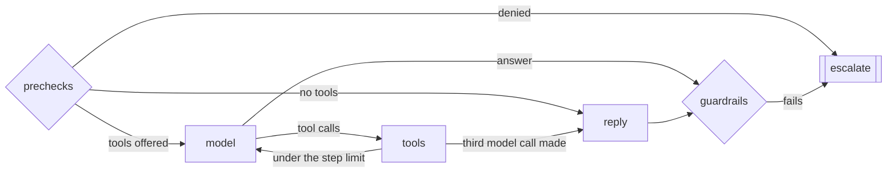

# ManyChat AI Agent

[](https://github.com/pedronastasi/manychat-ai-agent/actions/workflows/ci.yml)
[](https://pedronastasi.github.io/manychat-ai-agent/)
[](LICENSE)
[](https://github.com/pedronastasi/manychat-ai-agent/releases)
[](package.json)

A production-shaped, provider-agnostic AI agent that answers customer questions
on WhatsApp, Instagram and Facebook Messenger through
[ManyChat](https://manychat.com), escalating to a human rather than guessing.
Each turn is a [LangGraph.js](https://langchain-ai.github.io/langgraphjs/) graph
over LangChain.js models, served by Fastify, and traceable to your own
[LangSmith](https://smith.langchain.com): its shape, never its text.

Switching the model is one environment variable. Switching the chat platform is
one adapter.

It is for anyone putting an LLM behind a platform that enforces a hard webhook
timeout: ManyChat is the adapter that ships, and the race and the outbox below
are what carries over to any other.

```bash
git clone https://github.com/pedronastasi/manychat-ai-agent.git
cd manychat-ai-agent
pnpm install && pnpm bootstrap && pnpm dev
```

That runs with **no API key and no database to install** — an offline mock model
and an embedded [PGlite](https://pglite.dev/) Postgres. In another terminal,
`pnpm simulate` answers one question and hands one off:



That clone is for trying the agent and working on it. To run one for your own
business, generate a project of your own instead, which depends on the published
package rather than a copy of this repository:

```bash
npm create manychat-ai-agent@latest my-agent
```

[Starting a new agent](docs/guides/getting-started.md) walks through it,
from the offline first run to a deployment.

---

## The problem this solves

ManyChat can call an external endpoint, but **it terminates the request after 10
seconds**. An LLM call plus database work sometimes fits in that budget and
sometimes does not, so the obvious synchronous design drops replies under exactly
the conditions where a customer is already waiting.

This project takes the position that neither "always answer inline" nor "always
queue" is right, and races them.

```
inbound message
     │
     ├─ guards: keywords, turn cap, rate limit, daily budget ── denied ──▶ escalate to human
     │                                                                     (model never runs)
     ▼
  Promise.race
     ├── model answered  (< 8s) ──▶ reply inline + re-register callback
     │
     └── deadline hit    (= 8s) ──▶ short ack
                                     │
                                     └─ model keeps running ──▶ outbox ──▶ worker ──▶ Send API
```

The losing model call is **not cancelled**. Those tokens are already paid for and
the answer is still wanted, so it completes into a Postgres outbox and a worker
delivers it seconds later. The reply is never dropped, only deferred.

The conversation loop lives in this service rather than in ManyChat's visual flow
builder, via Dynamic Block's `external_message_callback`. That is what keeps the
agent portable instead of welded to one vendor's UI.

The full design — what fails closed, how spend is bounded, and every decision
record — is in [How it works](docs/guides/how-it-works.md).

## What it can do

- **Answer from the catalog, or hand off.** Every fact it may state lives in
  `config/catalog.json`; anything else escalates to a person rather than being
  guessed ([spec 001](specs/001-agent-behavior.md)).
- **Run on any model.** The model is one environment variable —
  `anthropic:claude-haiku-4-5`, `openai:gpt-5-mini`, `ollama:llama3.1:8b`, or the
  offline `mock:demo` — and only [`src/agent/registry.ts`](src/agent/registry.ts)
  imports a provider.
- **Keep each contact's history theirs.** A token held in the contact's own
  ManyChat field, not the shared secret, unlocks their conversation
  ([spec 019](specs/019-contact-tokens.md)).
- **Answer WhatsApp, Instagram and Messenger from one deployment.** Each request
  names its channel, and the reply, a deferred delivery and a follow-up go back
  on that channel alone. A contact ManyChat has merged across channels keeps one
  conversation ([spec 048](specs/048-one-deployment-every-meta-channel.md)).
- **Read voice notes, images and videos** sent on any of the three
  ([spec 020](specs/020-inbound-media.md)).
- **Act in ManyChat and sell.** Optionally send flows, set tags and fields, read
  the contact, schedule a follow-up, and take a lead to the payment link
  ([spec 012](specs/012-agent-tools.md), [spec 023](specs/023-sales-funnel.md)).
- **Learn from outcomes**, offline and only after a person approves
  ([spec 031](specs/031-learning-from-outcomes.md)).

## Stack

| Layer         | What                                                                                                             | Where                                                            |
| ------------- | ---------------------------------------------------------------------------------------------------------------- | ---------------------------------------------------------------- |
| HTTP          | Fastify 5, Zod type provider, helmet, rate limiting, under-pressure                                              | [`src/server.ts`](src/server.ts)                                 |
| Orchestration | LangGraph.js `StateGraph`                                                                                        | [`src/agent/langgraph-runner.ts`](src/agent/langgraph-runner.ts) |
| Models        | LangChain.js chat models (Anthropic, OpenAI, Gemini, Ollama, offline `mock:`); `openai` client for transcription | [`src/agent/registry.ts`](src/agent/registry.ts)                 |
| Tracing       | LangSmith, off unless `TRACE_TURNS=langsmith`                                                                    | [`src/observability/`](src/observability/)                       |
| Vercel AI SDK | Leaving ([spec 053](specs/053-one-model-library.md)); still the tool definitions and `google:` transcription     | [`src/agent/tools/`](src/agent/tools/)                           |
| Data          | Postgres via Drizzle; PGlite for development and tests. ManyChat via `manychat-sdk`                              | [`src/db/`](src/db/)                                             |

## Architecture: one turn

Three nodes, no checkpoint, between checks that hand off to a person:


```mermaid
flowchart LR
  pre{prechecks} -- denied --> human[[escalate]]
  pre -- tools offered --> model
  pre -- no tools --> reply
  model -- tool calls --> tools
  tools -- under the step limit --> model
  tools -- third model call made --> reply
  model -- answer --> guard{guardrails}
  reply --> guard
  guard -- fails --> human
```

`tools` runs reads and `send_flow` now and stages other writes until after the
reply, dropping them on an escalation. A turn escalates **before the graph** on
a keyword, the turn cap, the rate limit or the daily budget; **in it** when the
model sets `escalate`; **after it** when the reply fails its schema, falls below
`confidenceThreshold`, leaks working notes past one rewrite, or the call fails.
The contact gets the tenant's escalation message; the conversation is marked
escalated. A lost race is no escalation: the reply finishes into the outbox.

## Channels

Each channel's ManyChat flow calls one Dynamic Block endpoint and names its
channel, which must be in `CHANNELS`. The reply and a callback for the next
message return in the response; a deferred reply goes into a ManyChat field and
out through the channel's reply flow ([limits](src/contracts/config/channels.ts)):

| Channel   | Messages per reply             | Deferred reply after Meta's 24-hour window         | Reply flow                         |
| --------- | ------------------------------ | -------------------------------------------------- | ---------------------------------- |
| WhatsApp  | 1: the rest are joined into it | Sent; the reply flow's template carries it         | `MANYCHAT_REPLY_FLOW_NS`           |
| Instagram | Up to 10                       | Refused as `window_closed`, conversation escalated | `MANYCHAT_REPLY_FLOW_NS_INSTAGRAM` |
| Messenger | Up to 10                       | Refused as `window_closed`, conversation escalated | `MANYCHAT_REPLY_FLOW_NS_MESSENGER` |

## Configuration

All in [`.env.example`](.env.example): the model and its key, `PUBLIC_BASE_URL`
(HTTPS), `MANYCHAT_SHARED_SECRET`, `DATABASE_URL`, `CHANNEL`/`CHANNELS`. Tracing
is `TRACE_TURNS=langsmith`, `LANGSMITH_API_KEY=<your-key>` and
`LANGSMITH_PROJECT=<your-project>`; LangChain's own `LANGSMITH_TRACING` and its
siblings **stop boot** when `true` ([spec 052](specs/052-traces-carry-shape-not-text.md)).

## Documentation

The same pages, with search, are on the
[docs site](https://pedronastasi.github.io/manychat-ai-agent/).

| To…                                          | Read                                                                                |
| -------------------------------------------- | ----------------------------------------------------------------------------------- |
| Deploy an agent for your own business        | [Starting a new agent](docs/guides/getting-started.md)                              |
| Try it from a clone, with curl or Docker     | [Running it locally](docs/guides/running-locally.md)                                |
| Point ManyChat at it                         | [Connecting ManyChat](docs/guides/connecting-manychat.md)                           |
| Turn on tools, follow-ups or the funnel      | [Agent tools and the sales funnel](docs/guides/agent-tools-and-the-sales-funnel.md) |
| Write the tenant's prompt, catalog and rules | [Tenant configuration](config/README.md)                                            |
| Understand the design                        | [How it works](docs/guides/how-it-works.md) and the [decision records](docs/adr/)   |
| Know exactly what it must do                 | The [specs](specs/), starting from the [constitution](specs/000-constitution.md)    |
| Contribute                                   | [CONTRIBUTING](CONTRIBUTING.md)                                                     |

## Development

```bash
pnpm bootstrap     # local config + .env from the committed examples
pnpm dev           # offline by default: mock model, embedded Postgres
pnpm simulate "…"  # send a Dynamic Block request as ManyChat would
pnpm test          # unit + integration
pnpm eval:mock     # golden set, offline and free
pnpm eval:conversations:validate  # check the scripted conversations, no model call
pnpm lint && pnpm typecheck
```

## Status

MVP. Answers, escalates, and calls the tools a tenant turns on: flows, tags,
fields, contact reads, notes, follow-ups and the payment link. It does not book
or process a payment. Removing the AI SDK (spec 053) awaits its breaking step.

## License

MIT — see [LICENSE](LICENSE).
