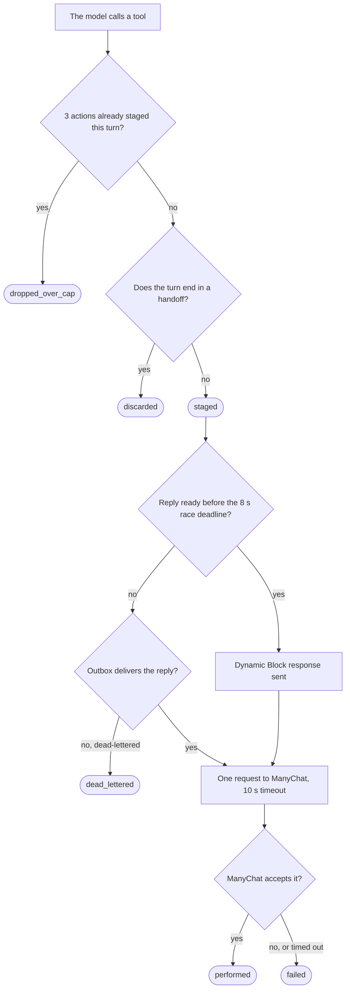

# Tenant configuration

Everything in this directory except `*.example` and this README is **gitignored**
and must never be committed (Constitution C1).

```bash
cp config/prompt.md.example   config/prompt.md
cp config/catalog.json.example config/catalog.json
cp config/rules.json.example   config/rules.json
```

`pnpm bootstrap` copies the examples for you (it never overwrites an existing
file). Invalid config fails at startup rather than at the first customer
message. A failed **reload** (`kill -HUP <pid>`) keeps the previous config, so
a typo cannot take down a running bot.

## `prompt.md`: persona

The system prompt preamble. Write it as instructions to the model: what tone to
use, what it may and may not do. The rest of the system prompt — the catalog,
the rules, the security fence — is assembled by the server.

The file is read as-is: there is no template substitution. The example uses
`{{businessName}}` as a placeholder for the person writing the prompt to
replace with the actual business name.

## `catalog.json`: facts the agent may cite

The only source of factual claims the agent may make. A price change is an edit
here plus `kill -HUP <pid>`, with no prompt editing and no deploy.

| Field                          | Type                   | Notes                                                   |
| ------------------------------ | ---------------------- | ------------------------------------------------------- |
| `businessName`                 | string                 | Interpolated into `prompt.md`                           |
| `currency`                     | string                 | ISO 4217, e.g. `USD`, `ARS`                             |
| `courses[]`                    | array (min 1)          | At least one course is required                         |
| `courses[].id`                 | string                 | Unique identifier                                       |
| `courses[].name`               | string                 | Display name                                            |
| `courses[].description`        | string                 |                                                         |
| `courses[].price`              | `{ amount, currency }` | `amount` is in minor units (cents) to avoid float drift |
| `courses[].durationHours`      | number \| null         |                                                         |
| `courses[].schedule`           | string \| null         |                                                         |
| `courses[].enrollmentUrl`      | URL \| null            |                                                         |
| `faq[]`                        | array                  | Optional (defaults to `[]`)                             |
| `faq[].question`               | string                 |                                                         |
| `faq[].answer`                 | string                 |                                                         |
| `paymentOptions[]`             | array                  | Optional (defaults to `[]`); see below                  |
| `paymentOptions[].id`          | string                 | Unique identifier                                       |
| `paymentOptions[].description` | string                 | How the option works, in your contacts' language        |

`paymentOptions` lists the ways to pay you offer: instalments, a deposit, a
private-class rate. The agent presents one when a contact says the course is too
expensive or asks to pay in parts. A request it does not cover, such as a
discount, still goes to a person (`specs/023-sales-funnel.md`).

## `rules.json`: behaviour and limits

### `messages` (required, no defaults)

Every message is required and has no default, because a missing value must fail
at boot rather than silently emitting English at a contact who does not read it
(Constitution C9).

| Key               | When it is sent                                                                   |
| ----------------- | --------------------------------------------------------------------------------- |
| `acknowledgement` | The model lost the race and the reply is deferred to the outbox                   |
| `escalation`      | The turn hands off to a human (any reason)                                        |
| `mediaFallback`   | The contact sent a voice note, image or video the agent cannot read (`specs/020`) |
| `closer`          | The model's reply repeats an earlier one word for word (`specs/013`)              |

`mediaFallback` is optional: without it, an unreadable media message hands off
with `escalation` instead of asking the contact to type.

`closer` is optional too: without it, a reply that repeats an earlier one is
recorded as `duplicate_detected` and sent as it is.

### Thresholds and limits

| Key                       | Default | Purpose                                                  |
| ------------------------- | ------- | -------------------------------------------------------- |
| `confidenceThreshold`     | `0.6`   | Below this, force escalation                             |
| `maxTurnsPerConversation` | `25`    | After this many turns the conversation escalates         |
| `idleResetHours`          | `24`    | Hours of silence after which the turn cap resets (`018`) |
| `historyDays`             | `30`    | How far back the model's history reaches (`018`)         |

### `escalationKeywords` (default `[]`)

Substring matches checked before the model runs — an instant, free handoff.

### `openingTrigger` (optional)

A sentinel the channel flow sends to start a conversation, and the scripted
reply it produces verbatim. The model never runs for it, so the opening is
instant and free and cannot be turned into a handoff by a low confidence score.
Unlike `escalationKeywords`, which match substrings, this matches the whole
message — a contact who mentions the phrase must not be able to replay the
opening. See `specs/001-agent-behavior.md`.

```json
"openingTrigger": { "keywords": ["start workflow"], "message": "…" }
```

### `budget`

| Key               | Default   | Purpose                 |
| ----------------- | --------- | ----------------------- |
| `dailyTokenCap`   | `1000000` | Max tokens per day      |
| `dailyCostCapUsd` | `5`       | Max spend (USD) per day |

### `rateLimit`

| Key                         | Default | Purpose                   |
| --------------------------- | ------- | ------------------------- |
| `turnsPerSubscriberPerHour` | `60`    | Per-subscriber rate limit |

## `tools.json`: actions the agent can take (optional)

Without `tools.json` the agent only replies. With it, the agent can also act on
the contact in ManyChat while it answers: send one of your flows, tag the
contact, or record a choice they made. The design is in
`specs/012-agent-tools.md` and `docs/adr/0010-bounded-tool-loop-with-staged-actions.md`.

`pnpm bootstrap` does not create this file, because tools are opt-in. To turn
them on:

```bash
cp config/tools.json.example config/tools.json
```

Then edit the file and restart, or send `kill -HUP <pid>`.

### What you configure

| Tool         | What it does in ManyChat                  | Configured by |
| ------------ | ----------------------------------------- | ------------- |
| `send_flow`  | Sends the contact one of your flows       | `flows`       |
| `add_tag`    | Adds one of your tags to the contact      | `tags`        |
| `remove_tag` | Removes one of your tags from the contact | `tags`        |
| `set_field`  | Writes one allowed value to a field       | `fields`      |

A list you leave empty or omit offers no tool for it. Each entry has:

- **`id`**: the name the model uses for the entry. Lowercase letters, digits,
  `_` and `-`, unique within its list. It is also what the turn record and the
  logs show.
- **`flowNs`, `tag` or `field`**: the object's name in your ManyChat account. The
  model never sees it, so renaming the object in ManyChat only needs an edit
  here.
- **`values`** (fields only): the only values the agent may write. The model
  picks one of them and can never write free text.
- **`description`**: what the entry is and when to use it. This is the only
  guidance the model gets, so write it as a condition, for example "Send when
  the contact asks for details, a syllabus or something to read". It may be in
  your contacts' language.

The agent always acts on the contact whose message it is answering. No tool
takes a contact as a parameter.

### The sales funnel (optional)

Three keys turn on the sales funnel of `specs/023-sales-funnel.md`:

- **`funnel: true`** on one field marks it as the place the agent records where
  the sale stands. Its `values` must be exactly `new`, `qualifying`, `nurturing`,
  `offered`, `link_sent`, in that order. The stage only moves forward, and the
  agent never writes `link_sent` itself.
- **`role: "payment_link"`** on one flow marks the flow that sends your payment
  link. When it is performed, the server writes the funnel field to
  `link_sent`.
- **`repeatable: true`** on a flow lets the agent send it more than once to the
  same contact. Every other flow is sent at most once per contact. The payment
  link is the usual case.

Each content flow must be a leaf: it must not start another flow. Nothing here
can see inside your flows, so this is yours to check. And turn off any drip
sequence that sends the same flows on a timer, or contacts will get each piece
twice.

Every other field in `fields` is a qualification question. The agent learns the
answers before it sends the first content flow, one question per turn, so write
each `description` as what to ask, for example "Whether the contact has studied
the subject before. Ask before sending content." The example file has two.

Add `paymentOptions` to `catalog.json` if you offer instalments or a deposit;
without them, "can I pay in parts?" goes to a person as `price_negotiation`.

#### Rolling it out

Most of this happens in your ManyChat account, not here:

1. **Measure the baseline first.** Record your enrolment rate over the four
   weeks before rollout, and the dates it covers. Without it, nothing can show
   the funnel changed anything.
2. **Create the funnel field** in ManyChat with the name you put in `field`,
   plus one field per qualification question. Create an `enrolled` tag for the
   person who confirms payments; the agent never sets it.
3. **Make each content flow a leaf.** Open every flow listed in `flows` and
   remove any step that starts another flow.
4. **Retire the drip.** Change the entry flow so it hands the contact to the
   agent's Dynamic Block instead of starting a sequence. An agent and a drip on
   the same contact send every piece twice.
5. **Tell whoever answers handoffs** about the new `payment_reported` reason:
   those contacts say they have paid and are waiting for a person to check.
6. **Add eval cases** for your own flows and objections, and run `pnpm eval`
   against the real model (`specs/009-tenant-eval-suites.md`).

#### Measuring it

Two rates, reported separately and never combined:

| Measure        | Over contacts whose first turn fell in the week…      | Where it comes from   |
| -------------- | ----------------------------------------------------- | --------------------- |
| Link-sent rate | …whose payment-link flow was `performed`              | `turns.actions`, here |
| Paid enrolment | …that a person tagged `enrolled` after seeing payment | Your ManyChat account |

Link-sent rate is the one this service can compute. Replace
`enrolment_link` with your payment-link flow's `id`:

```sql
WITH firsts AS (
  SELECT c.id, date_trunc('week', min(t.created_at)) AS week
  FROM conversations c JOIN turns t ON t.conversation_id = c.id
  GROUP BY c.id
), linked AS (
  SELECT DISTINCT t.conversation_id AS id
  FROM turns t, jsonb_array_elements(t.actions) AS a
  WHERE a ->> 'tool' = 'send_flow'
    AND a ->> 'id' = 'enrolment_link'
    AND a ->> 'status' = 'performed'
)
SELECT f.week, count(*) AS contacts, count(l.id) AS link_sent,
       round(100.0 * count(l.id) / count(*), 1) AS link_sent_pct
FROM firsts f LEFT JOIN linked l USING (id)
GROUP BY f.week ORDER BY f.week;
```

A rising link-sent rate with a flat enrolment rate means the agent is asking
too early, or too hard. Only the enrolment rate tells a better agent from a
pushier one, so read real conversations after rollout as well: the golden set
only catches the pressure phrasings someone thought to write down.

### Startup checks

`tools.json` is validated like the other config files: a malformed file fails
the boot, and a malformed reload is refused and the previous config is kept. A
file is also refused if it names an object this service already uses for
delivery:

- a flow whose `flowNs` is `MANYCHAT_REPLY_FLOW_NS`;
- a field whose `field` is `MANYCHAT_REPLY_FIELD` or `MANYCHAT_TOKEN_FIELD`.

It is also refused if more than one field is marked `funnel`, if a funnel field's
values are not the five stages in order, or if more than one flow has
`role: "payment_link"`.

### What happens on a turn

1. **The model chooses.** It may call tools before writing its reply. A call
   only stages the action. Nothing reaches ManyChat while the model is running.
   A turn stages at most 3 actions, and identical calls count once. A call past
   the limit is dropped.
2. **The model writes the reply.** It is told what was staged and that nothing
   has been sent yet, so it says what it is sending rather than claiming it
   has sent it.
3. **The guardrails decide.** If the turn ends in a handoff for any reason, every
   staged action is discarded. The reasons are: the model escalated,
   confidence was too low, a prompt leak, an invalid reply, a failed model call,
   or `MODEL_ABORT_MS`.
4. **The text goes first, then the actions.** On an inline reply, the actions run
   after the response to ManyChat has been sent. On a deferred reply, the outbox
   worker runs them after it has delivered the text, and if the reply is
   dead-lettered its actions are dropped. Actions run in the order the model
   staged them, one request each, with a 10-second timeout. Each gets one
   attempt: a failure is logged at `warn` as `action failed` and is not retried.
5. **Later turns remember.** History shows the model a line such as
   `[actions performed: send_flow foundation_brochure]` under the reply that
   performed it, so it does not send the same flow again. Only `performed`
   actions are listed. The server writes that line, and the guardrails remove
   it if the model copies it into a reply.

Turns where the model does not run (the scripted opening, escalation keywords,
budget, rate and turn caps) offer no tools and stage nothing.

### Seeing what the agent did

Every agent turn records its actions in the `actions` column of `turns`. It is
`null` when no tool was offered and `[]` when tools were offered and none was
chosen. Otherwise it has one entry per staged action:

```json
[{ "tool": "send_flow", "id": "foundation_brochure", "status": "performed" }]
```

How an action reaches each status. The rounded boxes are the statuses you will
see in the column:



| `status`           | Meaning                                                    |
| ------------------ | ---------------------------------------------------------- |
| `staged`           | Waiting to be performed, after the response or the outbox  |
| `performed`        | ManyChat accepted the request                              |
| `failed`           | ManyChat refused it or it timed out; `error` says why      |
| `discarded`        | The turn ended in a handoff                                |
| `dropped_over_cap` | Staged past the limit of 3 and never sent                  |
| `dead_lettered`    | Its deferred reply was dead-lettered, so it was never sent |

Entries hold ids and values only, never ManyChat names or contact text. An entry
that stays `staged` means the process stopped before the action ran. That action
is never retried.

```sql
SELECT t.created_at, t.outcome, t.actions
FROM turns t JOIN conversations c ON c.id = t.conversation_id
WHERE c.subscriber_id = '<subscriber id>' AND t.role = 'agent'
ORDER BY t.seq;
```

### Before turning tools on in production

- **Expect slower replies.** A tool turn takes two model calls. In a local run on
  2026-09-28 with `openai:gpt-5-mini` at low reasoning effort, four tool turns
  took 8.4 to 15.5 seconds. All of them missed the 8-second deadline, so each
  contact got the holding message first and the answer through the outbox.
  The same model answered a question with no tools offered in 5.8 seconds.
- **Test the descriptions.** No check can tell whether a `description` leads the
  model to the right flow. Add eval cases that state the expected choice with
  `expect.actions`, as the golden set does:

  ```jsonl
  {"id":"flow-brochure","text":"can you send me something to read about the foundation course?","expect":{"escalate":false,"actions":["send_flow foundation_brochure"]}}
  {"id":"flow-not-for-schedule","text":"when does the weekend intensive run?","expect":{"escalate":false,"actions":[]}}
  ```

  `[]` asserts that tools were offered and none was chosen. Run them with
  `pnpm eval` against the real model.

- **`performed` is ManyChat's answer, not the contact's.** It means ManyChat
  accepted the request. A flow that is unpublished, or points at a missing file,
  can still be accepted. Send each flow to yourself once from ManyChat before
  listing it here.
- **Actions need `MANYCHAT_API_TOKEN`.** Without it every action is recorded as
  `failed`.
