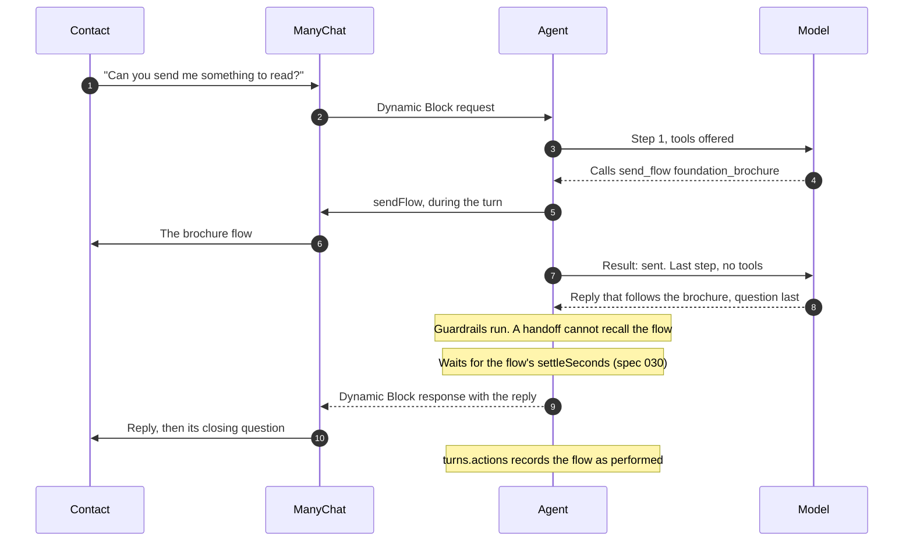
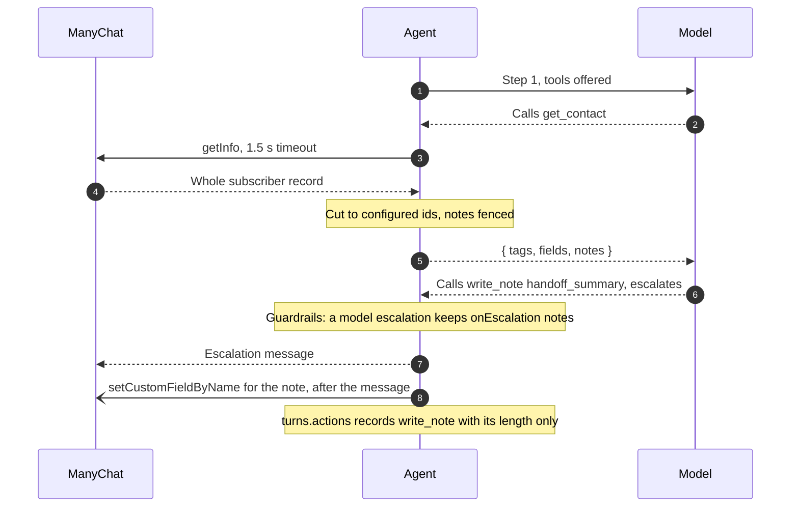
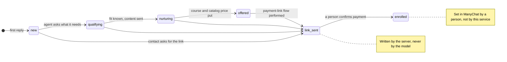

# Agent tools and the sales funnel

What the agent can do beyond answering: act on the contact in ManyChat, read
what is recorded on them, follow up when they go quiet, and take a lead to the
payment link. Each is optional and configured in
[config/README.md](../../config/README.md#toolsjson-actions-the-agent-can-take-optional).

## Acting on the contact

With an optional `config/tools.json`, the agent can also act on the contact in
ManyChat: send one of the tenant's flows, add or remove a tag, or record one of a
field's allowed values ([spec 012](../../specs/012-agent-tools.md)). It can also read
what is recorded on the contact and write short notes for the team
([spec 024](../../specs/024-contact-read-and-notes.md)).

A turn where the contact asks for something to read, answered inside the
deadline ([spec 029](../../specs/029-flows-before-the-reply.md)):

When the model misses the deadline, the contact gets the holding message; the
flow has already gone out, and the outbox worker delivers the reply after it.

- **A flow goes out when the model sends it** (ADR-0019). The model is told
  whether ManyChat accepted it and writes its reply after, so the contact reads
  the flow, then the reply, then its question. A handoff later in the turn
  cannot recall it. A payment link takes the turn's stage writes with it, so
  `link_sent` is the last stage ManyChat is given. A nudge turn keeps its flows
  staged.
- **Every other tool call only stages the action.** Tags, fields, notes and
  nudges reach ManyChat after the reply has gone out, either as the Dynamic
  Block response or through the outbox, and a turn that ends in a handoff
  discards them. A turn has at most four model steps and eight actions, and
  each action gets one attempt.
- **The model only picks from the config.** It names entries by `id`, never a
  ManyChat name or free text, and every action lands on the contact whose
  message it is answering.
- **Every action is recorded** on its turn with what became of it, and the next
  turn's history tells the model what it already sent.

### Reading the contact and writing notes

`get_contact` is the one tool performed while the model runs (ADR-0016): reading
changes nothing on the contact, so there is nothing for a handoff to undo.
`write_note` stages free text like any other write (ADR-0017).

- **A read returns a whitelist.** The client parses ManyChat's `getInfo` down to
  tag names and field values, so the contact's name, phone and email never
  reach the model. It returns only the tags, fields and notes `tools.json`
  lists, by id. A field holding a value outside its list reads as `other`.
- **Notes come back fenced.** A note summarises the contact's words, so it is
  returned inside the same fence as their messages and treated as data (C4).
- **A read never blocks the reply.** It gives up after 1.5 seconds and returns
  `{ available: false }`, and the turn goes on. A turn reads at most twice, and
  only when it carries the contact's token (specs/019).
- **Notes are bounded and cleaned.** A note field must be declared
  `"neverRendered": true` and capped at 500 characters. Links, emails, phone
  numbers and long numbers are replaced by `[removed]` before it is staged. The
  turn record holds the note's length, never its text, and so do the logs.
- **A handoff summary survives the handoff.** A note marked `onEscalation` is
  still written after the escalation message, but only when the model or the
  confidence threshold escalated. On a leak, an invalid reply or a failed call
  it is discarded with everything else.

### Following up on a quiet contact

With a `nudge` section, the agent can also schedule one follow-up for a contact
who goes quiet ([spec 025](../../specs/025-in-window-nudge.md)). A worker checks at
due time that the contact has not written, no person has taken over, the sale
is not closed and WhatsApp's 24-hour window is still open. Only then does it
run a model turn on a system note in place of a message. The model may decline,
and then nothing is sent. Otherwise the follow-up goes out through the outbox,
and it never schedules another.

How to configure tools and follow-ups, read the record, and what to check before
enabling them is in
[config/README.md](../../config/README.md#toolsjson-actions-the-agent-can-take-optional).

## Sales funnel

With a funnel field and a payment-link flow in `tools.json`, the agent takes a
new lead from their first reply to the payment link instead of only answering
questions ([spec 023](../../specs/023-sales-funnel.md),
[ADR-0015](../adr/0015-the-agent-closes-the-sale.md)). It replaces a drip
sequence: each piece the drip used to send on a timer becomes a flow the agent
sends when the conversation calls for it.

The agent records where the sale stands in a ManyChat field, one stage at a time:

- **The stage only moves forward.** A write to an earlier stage than the last
  one performed is refused, so a confused turn cannot send a lead back to
  `qualifying` after the offer. The model is told the contact's current stage
  on every turn.
- **The agent qualifies before it sends content**, one question per turn, and
  records each answer with `set_field`. A direct question is answered first,
  and a contact who asks for the link gets it, qualified or not.
- **Each flow is sent at most once per contact** within the history window. A
  flow already performed is removed from the model's choices on the next turn,
  unless it is marked `repeatable`, as the payment link usually is.
- **The server, not the model, writes `link_sent`.** It is a follow-on of the
  payment-link flow: it runs only once ManyChat accepted the flow, and a failed
  flow writes no stage. It does not count against the eight-action cap.
- **Objections are answered from the catalog.** "Too expensive" or "can I pay
  in parts?" gets the catalog's `paymentOptions`; "I don't have time" gets the
  content flow that addresses it. A discount request that no payment option
  answers still escalates as `price_negotiation`.
- **It asks for the sale, and never invents a reason to buy now.** Once the
  stage is `offered`, the closing question asks for the enrolment plainly. No
  invented scarcity or deadline, no promised job outcome, no price absent from
  the catalog: a deposit or instalment figure is allowed only because it is in
  `paymentOptions`.
- **Payment is a person's job.** A contact who says they have paid, or sends a
  receipt, is escalated as `payment_reported`. The agent cannot see the payment
  and never confirms it.

The stage rules are system instructions, the same for every tenant. How the
agent sounds while selling is the tenant's, in `config/prompt.md` and each
flow's `description`. Setup, the rollout checklist and how to measure the
result are in
