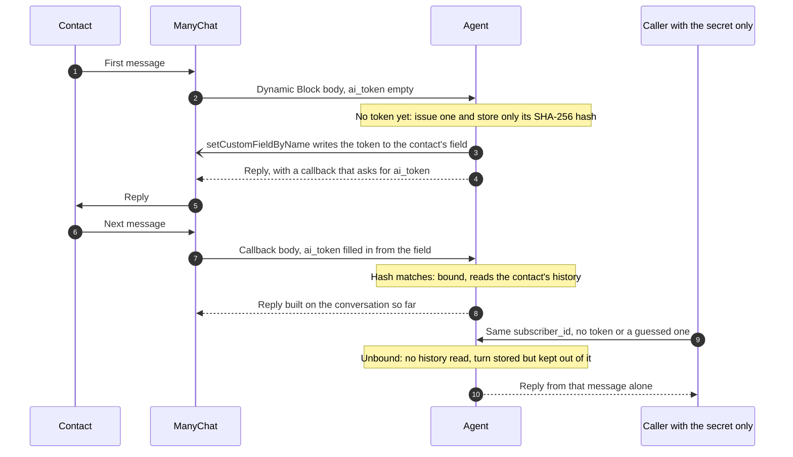

# Connecting ManyChat

What a deployment needs on the ManyChat side, and what the agent does with each
contact's token and the media they send. Generating the deployment itself is
[Starting a new agent](getting-started.md).

## The Dynamic Block

A deployment is a tenant project that depends on this package, never a fork of
this repository (ADR-0021). Generate one from the fictional demo tenant:

```bash
npm create manychat-ai-agent@latest my-agent
```

It writes `config/`, an offline `.env`, an eval suite, CI, Compose and
Renovate, depending on the agent and its image at the scaffolder's version.
Replace `config/` with your own and keep the repository private: the generated
CI fails when it is public
([specs/035](../../specs/035-create-scaffolds-a-tenant-project.md)). The steps are in
[Starting a new agent](getting-started.md).

Point a ManyChat **Dynamic Block** (Dev Tools, requires a Pro plan) at
`POST /v1/channels/manychat/message` and add an `Authorization: Bearer <secret>`
header matching `MANYCHAT_SHARED_SECRET`. The OpenAPI document is generated from
the same schemas that validate at runtime.

Create a Text custom field named `ai_token` (or whatever `MANYCHAT_TOKEN_FIELD`
names), then send it as a top-level key of the Dynamic Block's request body,
next to the keys you already send:

```json
{
  "subscriber_id": "{{contact.id}}",
  "text": "{{last_input_text}}",
  "ai_token": "{{ai_token}}"
}
```

Insert the value with ManyChat's variable picker rather than typing it, so it
points at the field. The key is always `ai_token`; any key the service does not
know is refused with a 400. Nothing else needs configuring: the callback the
service registers asks for the same field.

## Contact tokens



- **The token never appears in a response or a log line.** It reaches the
  contact's field only through ManyChat's API, so the only way to present it is
  to be the contact ManyChat sends it for.
- **An unbound request repairs itself.** It also writes a fresh token to the
  contact's field, at most once an hour. That fixes a cleared field or a failed
  write, and a forger triggering it gains nothing, because the token goes only
  to the real contact.
- **The previous token stays valid** until the next one is issued, so a message
  sent while a new token is being written still binds.
- **A failed write is retried by the outbox worker** with a fresh token. The
  token itself is stored nowhere but the contact's field.

Turning tokens on for a deployment that already has contacts takes a flag and a
backfill, in that order, or everyone loses their context at once. The five steps
are in
[spec 019](../../specs/019-contact-tokens.md#tokens-reach-existing-contacts-before-they-are-required);
`pnpm tokens:backfill` (`node dist/backfill.js` in the image) is step 2, and its
`--check` is step 4.

## Voice notes, images and videos

WhatsApp media reaches the service as a link in `text`. The service downloads
the file itself, and the link is never stored, logged or shown to the model
([spec 020](../../specs/020-inbound-media.md)):

- **A voice note** is transcribed by `TRANSCRIPTION_MODEL` and then treated as
  typed text, escalation keywords included.
- **An image** goes to the answering model once, as bytes. History keeps
  `[image]` in its place.
- **A video** is split by ffmpeg, which is part of the image, into up to four
  frames and a transcript of its soundtrack.

Whatever it cannot read gets `rules.messages.mediaFallback`, which asks the
contact to type. Without that message, the turn hands off to a person. A failed
download or transcription always hands off. The boot log's `media
capabilities` line shows what this server can read.
